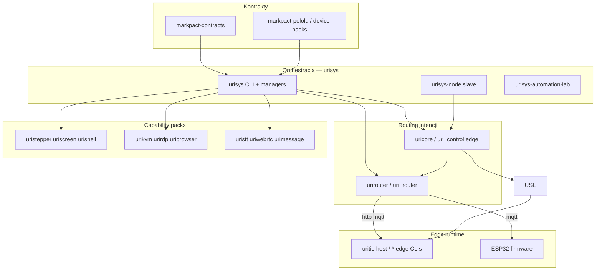
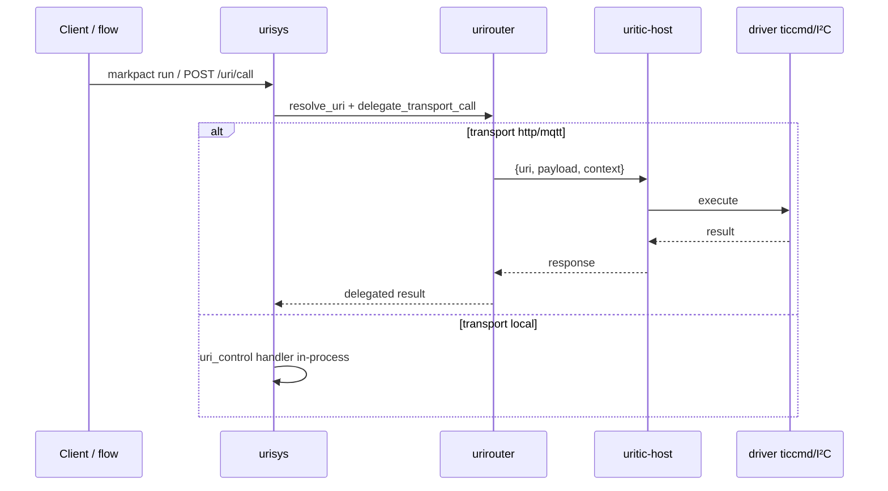

# TellMesh mesh — mapa paczek (centrum: urisys)

Stan: 2026-06-18. **urisys** jest centralnym orchestratorem URI control plane; pozostałe repo to capability packi, runtime edge, kontrakty i router intencji.

## Diagram warstw



## Zasada podziału

```text
Markpact     → CO (capability, flow, policy)
urisys       → wykonanie, approval, flow runner, events, CLI
urirouter    → GDZIE + JAK (resolve → transport → koperta wire)
uricore      → registry, policy, dispatch, handlers, event store
*-edge/host  → runtime fizyczny (HTTP/MQTT /uri/call)
```

UriRouter **nie routuje pakietów** — routuje **intencje** (`operation` z URI).

## Paczki rdzeniowe (zależności urisys)

| Paczka | Repo | Moduł import | Rola względem urisys |
|--------|------|--------------|----------------------|
| **urisys** | [tellmesh/urisys](https://github.com/tellmesh/urisys) | `urisys` | CLI, PackManager, Markpact, FlowController, BridgeManager |
| **urirouter** | [tellmesh/urirouter](https://github.com/tellmesh/urirouter) | `uri_router` | Resolver YAML, HTTP/MQTT delegate, envelope |
| **uricore** | [tellmesh/uricore](https://github.com/tellmesh/uricore) | `uri_control` + `uri_control.edge` | CapabilityRegistry, policy, handlers, edge Runtime |
| **urioperators** | [tellmesh/urioperators](https://github.com/tellmesh/urioperators) | `urioperators` | Wspólne helpery LLM (chat, plan, decide) |
| **urisys-node** | [tellmesh/urisys-node](https://github.com/tellmesh/urisys-node) | `urisys_node` | Slave node, lazy pack load, screen capture |
| **markpact-contracts** | [tellmesh/markpact-contracts](https://github.com/tellmesh/markpact-contracts) | — | Przykłady resolverów, transport binding, procesy |

## Przepływ wywołania (Pololu / stepper)



Przykład end-to-end: [markpact-pololu](https://github.com/tellmesh/markpact-pololu) · [URI-ROUTER.md](https://github.com/tellmesh/markpact-pololu/blob/main/docs/URI-ROUTER.md).

## Capability packs (rejestrowane przez urisys)

| Scheme | Repo | Edge / Docker glue | Port (typ.) |
|--------|------|-------------------|-------------|
| `stepper://` | [uristepper](https://github.com/tellmesh/uristepper) | [uristepperedge](https://github.com/tellmesh/uristepperedge), [markpact-pololu](https://github.com/tellmesh/markpact-pololu) | 8791 |
| `screen://` | [uriscreen](https://github.com/tellmesh/uriscreen) | [urisys-node](https://github.com/tellmesh/urisys-node) | 8790 |
| `shell://` | [urishell](https://github.com/tellmesh/urishell) | urirdpedge, urisys-node | — |
| `rdp://` | [urirdp](https://github.com/tellmesh/urirdp) | [urirdpedge](https://github.com/tellmesh/urirdpedge), [urirdp-docker](https://github.com/tellmesh/urisys/tree/main/urirdp-docker) | 8795 |
| `kvm://` `him://` `ocr://` `llm://` | [urikvm](https://github.com/tellmesh/urikvm) [urihim](https://github.com/tellmesh/urihim) [uriocr](https://github.com/tellmesh/uriocr) [urillm](https://github.com/tellmesh/urillm) | [urikvmedge](https://github.com/tellmesh/urikvmedge), [urikvm-docker](https://github.com/tellmesh/urisys/tree/main/urikvm-docker) | 8794 |
| `browser://` | [uribrowser](https://github.com/tellmesh/uribrowser) | [uribrowser-docker](https://github.com/tellmesh/urisys/tree/main/uribrowser-docker) | 8797 |
| `env://` | [urienv](https://github.com/tellmesh/urienv) | [urienv-docker](https://github.com/tellmesh/urisys/tree/main/urienv-docker) | 8798 |
| `stt://` `webrtc://` `message://` | [uristt](https://github.com/tellmesh/uristt) [uriwebrtc](https://github.com/tellmesh/uriwebrtc) [urimessage](https://github.com/tellmesh/urimessage) | [urisys-automation-lab](https://github.com/tellmesh/urisys-automation-lab) | 8099 |
| `mail://` `office://` | [urimail](https://github.com/tellmesh/urimail) [urioffice](https://github.com/tellmesh/urioffice) | — | — |
| `vql://` | [urivql](https://github.com/tellmesh/urivql) | forward worker | — |

Pełna tabela layoutu: [`PACKAGES.md`](PACKAGES.md).

## Narzędzia workflow (opcjonalne)

| Repo | Rola względem urisys |
|------|----------------------|
| [uri2flow](https://github.com/tellmesh/uri2flow) | Kompilacja grafów flow |
| [uri3](https://github.com/tellmesh/uri3) | Resolver schematów URI3 (≠ UriRouter transport) |
| [uri2ops](https://github.com/tellmesh/uri2ops) | Operacje / pipeline ops |
| [uri2run](https://github.com/tellmesh/uri2run) | Run artifacts |
| [uri2pact](https://github.com/tellmesh/uri2pact) | Markpact tooling |
| [nl2uri](https://github.com/tellmesh/nl2uri) | NL → URI (eksperymentalne) |

## Workspace dev

```text
tellmesh/
├── urisys/              ★ orchestrator (ten dokument)
├── urirouter/           ★ resolve + transport delegate
├── uricore/             capability dispatch
├── uricore/                capability dispatch + edge runtime
├── urioperators/        LLM helpers
├── urisys-node/         slave
├── markpact-contracts/  shared contracts
├── markpact-pololu/     Pololu reference + resolver generator
└── {uristepper,urikvm,…}/  capability packs
```

```bash
cd tellmesh/urisys
uv sync
pip install -e ../urirouter -e ../uricore

urisys routes --packs all
urisys markpact validate markpact-contracts/packs/machine-cycle-process.markpact.md
```

## Resolver config (urirouter)

```yaml
# profiles/urisys.runtime.hybrid.yaml (generated from markpact-pololu/targets.yaml)
environment: edge-linux
targets:
  tic-t249-pc:
    transport: http
    endpoint: http://127.0.0.1:8791/uri/call
  tic-t249-esp32:
    transport: http
    endpoint: http://esp32-tic.local:8791/uri/call
```

Ładowanie w urisys:

```bash
export URISYS_RESOLVER_CONFIG=profiles/urisys.runtime.hybrid.yaml
urisys markpact run … --config profiles/edge.config.yaml
```

API Python:

```python
from uri_router import UriRouter

router = UriRouter()
router.load("profiles/urisys.runtime.hybrid.yaml")
router.delegate("stepper://tic-t249/axis/x/query/status", {}, {"dry_run": True})
```

## Dystrybucja (skrót)

| Paczka | Instalacja slave |
|--------|------------------|
| uricore | GitHub Release wheel (includes `uri_control.edge`) |
| urisys-node | GitHub Release wheel |
| urirouter | GitHub Release v0.1.0 / PyPI (plan) |

Szczegóły: [`DISTRIBUTION.md`](DISTRIBUTION.md) · [`REPOS.md`](REPOS.md) · [`NODE-SETUP.md`](NODE-SETUP.md).

## Powiązana dokumentacja

| Dokument | Temat |
|----------|-------|
| [`ARCHITECTURE.md`](ARCHITECTURE.md) | Warstwy urisys monorepo |
| [`PROCESS-ARCHITECTURE.md`](PROCESS-ARCHITECTURE.md) | Markpact vs resolver vs marksync |
| [`PACKAGES.md`](PACKAGES.md) | Layout packów i docker glue |
| [`REPOS.md`](REPOS.md) | Mapowanie GitHub |
| [markpact-pololu/REFACTORING.md](https://github.com/tellmesh/markpact-pololu/blob/main/docs/REFACTORING.md) | Status refaktoryzacji UriRouter |
| [urirouter/README.md](https://github.com/tellmesh/urirouter/blob/main/README.md) | API pakietu urirouter |

## Roadmap

| Etap | Status |
|------|--------|
| Wyodrębnienie `urirouter` z `uricore` | ✅ 0.1.0 |
| Shimy `uri_control.resolver/transport/envelope` | ✅ |
| `urisys` zależność bezpośrednia | ✅ |
| PyPI publish `urirouter` | 📋 |
| `urirouter-embedded` / `uri_routes.h` (marksync) | 📋 |
| Centralna `policy.operations` | 📋 |
