# System Architecture Analysis
<!-- generated in 0.00s -->

## Overview

- **Project**: /home/tom/github/tellmesh/urisys
- **Primary Language**: python
- **Languages**: python: 49, shell: 41, yaml: 7, json: 1, yml: 1
- **Analysis Mode**: static
- **Total Functions**: 366
- **Total Classes**: 22
- **Modules**: 102
- **Entry Points**: 158

## Architecture by Module

### scripts.lenovo_remote_session
- **Functions**: 25
- **File**: `lenovo_remote_session.py`

### src.urisys.managers.markpact_manager
- **Functions**: 22
- **Classes**: 1
- **File**: `markpact_manager.py`

### scripts.run_test_sessions
- **Functions**: 18
- **File**: `run_test_sessions.py`

### scripts.session_core
- **Functions**: 16
- **File**: `session_core.py`

### src.urisys.managers.pack_manager
- **Functions**: 14
- **Classes**: 1
- **File**: `pack_manager.py`

### scripts.test_sessions.util
- **Functions**: 14
- **File**: `util.py`

### scripts.pack_sync
- **Functions**: 13
- **File**: `pack_sync.py`

### src.urisys.managers.source_manager
- **Functions**: 12
- **Classes**: 2
- **File**: `source_manager.py`

### src.urisys.uricore_install
- **Functions**: 11
- **File**: `uricore_install.py`

### src.urisys.cli
- **Functions**: 11
- **File**: `cli.py`

### src.urisys.doctor
- **Functions**: 11
- **Classes**: 1
- **File**: `doctor.py`

### src.urisys.init_setup
- **Functions**: 11
- **File**: `init_setup.py`

### src.urisys.node_install
- **Functions**: 9
- **File**: `node_install.py`

### scripts.pack_registry
- **Functions**: 9
- **Classes**: 1
- **File**: `pack_registry.py`

### scripts.report.lab_checks
- **Functions**: 9
- **File**: `lab_checks.py`

### scripts.test_sessions.expectations
- **Functions**: 9
- **File**: `expectations.py`

### scripts.report.session_markdown
- **Functions**: 8
- **File**: `session_markdown.py`

### scripts.test_sessions.lab_rdp
- **Functions**: 8
- **File**: `lab_rdp.py`

### examples.frontend.app
- **Functions**: 6
- **File**: `app.js`

### src.urisys.edge_install
- **Functions**: 6
- **File**: `edge_install.py`

## Key Entry Points

Main execution flows into the system:

### scripts.lenovo_remote_session.main
- **Calls**: argparse.ArgumentParser, parser.add_argument, parser.add_argument, parser.add_argument, parser.add_argument, parser.add_argument, parser.add_argument, parser.add_argument

### scripts.run_test_sessions.session_urirdp_real_docker
- **Calls**: scripts.session_core.now_iso, scripts.test_sessions.util.write_meta, scripts.test_sessions.util.prepare_urirdp_data, scripts.test_sessions.util.sleep_ports, scripts.test_sessions.util.run_cmd, scripts.test_sessions.util.run_cmd, scripts.test_sessions.util.finalize_session, scripts.test_sessions.util.compose_cmd

### src.urisys.managers.markpact_manager.MarkpactManager.compile
- **Calls**: Path, self.read_blocks, self.load_pack_block, self.source_hash, self._package_id, _safe_identifier, self.validate, cache_dir.mkdir

### scripts.pack_sync.main
- **Calls**: argparse.ArgumentParser, parser.add_subparsers, sub.add_parser, p_init.add_argument, p_init.add_argument, sub.add_parser, p_uv.add_argument, p_uv.add_argument

### scripts.scan-browser-sessions.main
- **Calls**: argparse.ArgumentParser, parser.add_argument, parser.add_argument, parser.parse_args, Path.home, scripts.scan-browser-sessions.discover_browsers, scripts.run-nl-log-smoke.print, scripts.run-nl-log-smoke.print

### scripts.test_sessions.lab_flows.session_lab_10_flows
> Run all 10 automation-lab flows; capture one RDP screenshot per flow.
- **Calls**: scripts.session_core.now_iso, scripts.test_sessions.util.write_meta, scripts.test_sessions.util.sleep_ports, scripts.test_sessions.util.run_cmd, scripts.test_sessions.util.run_cmd, scripts.test_sessions.util.finalize_session, steps.append, scripts.test_sessions.util.finalize_session

### scripts.run_test_sessions.main
- **Calls**: argparse.ArgumentParser, parser.add_argument, parser.add_argument, parser.add_argument, parser.add_argument, parser.parse_args, run_dir.mkdir, scripts.run-office-writer-e2e.save_json

### scripts.run_test_sessions.session_urirdp_mock_docker
- **Calls**: scripts.session_core.now_iso, scripts.test_sessions.util.write_meta, scripts.test_sessions.util.prepare_urirdp_data, scripts.test_sessions.util.sleep_ports, scripts.test_sessions.util.run_cmd, scripts.test_sessions.util.run_cmd, scripts.test_sessions.util.finalize_session, scripts.test_sessions.util.compose_cmd

### src.urisys.managers.source_manager.SourceManager.fetch
- **Calls**: source.strip, spec.startswith, spec.startswith, spec.startswith, _GITHUB_SHORT.match, spec.startswith, spec.startswith, None.expanduser

### src.urisys.managers.markpact_manager.MarkpactManager.run_tests
- **Calls**: self.compile, UriController, yaml.safe_load, isinstance, ctrl.close, all, compiled.to_dict, compiled.tests_path.exists

### src.urisys.managers.source_manager.SourceManager._fetch_git
- **Calls**: body.split, urlsplit, parse_qs, urlunsplit, self._cache_dir, cache_dir.mkdir, checkout_dir.exists, checkout_dir.mkdir

### src.urisys.managers.markpact_manager.MarkpactManager.validate
- **Calls**: Path, self.read_blocks, self._yaml_blocks, self._yaml_blocks, self._yaml_blocks, self._yaml_blocks, self.source_hash, MarkpactError

### src.urisys.managers.pack_manager.PackManager.manifest_paths
- **Calls**: self._is_markpact_path, self._is_manifest_path, self.resolve_package_name, None.joinpath, self._stack.enter_context, paths.append, self.source_manager.resolve, paths.append

### scripts.report.cli.main
- **Calls**: argparse.ArgumentParser, parser.add_subparsers, sub.add_parser, gen.add_argument, sub.add_parser, ana.add_argument, ana.add_argument, parser.parse_args

### src.urisys.managers.markpact_manager.MarkpactManager._validate_pack
- **Calls**: self._package_id, self._capabilities, self._handler_blocks, set, sorted, self._scheme, isinstance, MarkpactError

### src.urisys.cli.main
- **Calls**: None.parse_args, src.urisys.cli._cmd_uri, src.urisys.cli.build_parser, src.urisys.cli._cmd_markpact, src.urisys.doctor.run_doctor, src.urisys.cli.print_json, src.urisys.cli._cmd_init, scripts.run-nl-log-smoke.print

### src.urisys.controllers.flow_controller.FlowController.run
- **Calls**: src.urisys.flow.load_flow, src.urisys.flow.iter_steps, flow.get, self.uri_controller.call, results.append, all, flow.get, bool

### src.urisys.managers.markpact_manager.MarkpactManager._build_route
> Compile one capability entry into a manifest route, registering its
generated python handler in ``handlers`` when the source is a markpact://
or pytho
- **Calls**: str, _scheme_from_uri, None.replace, str, self._resolve_handler_ref, MarkpactError, MarkpactError, MarkpactError

### scripts.run_test_sessions.session_urirdp_rdp_e2e
- **Calls**: scripts.session_core.now_iso, scripts.test_sessions.util.write_meta, scripts.test_sessions.util.prepare_urirdp_data, scripts.test_sessions.util.sleep_ports, scripts.test_sessions.util.run_cmd, scripts.test_sessions.util.run_cmd, scripts.test_sessions.util.docker_logs, scripts.test_sessions.util.docker_logs

### src.urisys.managers.source_manager.SourceManager._fetch_zip
- **Calls**: body.split, self._cache_dir, cache_dir.mkdir, self._http_download, in_archive_path.lstrip, self._result, SourceError, local_path.exists

### scripts.test_sessions.lab_rdp.parse_lab_flow
- **Calls**: dict, yaml.safe_load, data.get, isinstance, path.read_text, data.get, steps.append, isinstance

### src.urisys.managers.markpact_manager.MarkpactManager._check_expectations
> Compare a test result against its declared expectations.
- **Calls**: failures.append, failures.append, None.items, bool, bool, result.get, result.get, None.get

### src.urisys.managers.source_manager.SourceManager._fetch_http
- **Calls**: self._cache_dir, cache_dir.mkdir, self._http_download, local_path.write_bytes, meta_path.write_text, self._result, spec.startswith, local_path.exists

### scripts.run_test_sessions.session_urisys_node_docker_gui
- **Calls**: scripts.session_core.now_iso, int, scripts.test_sessions.util.write_meta, os.environ.copy, str, scripts.test_sessions.util.run_cmd, steps.append, scripts.test_sessions.util.finalize_session

### scripts.run_test_sessions.session_office_simulate
- **Calls**: scripts.session_core.now_iso, int, scripts.test_sessions.util.write_meta, os.environ.copy, str, scripts.test_sessions.util.run_cmd, steps.append, scripts.test_sessions.util.finalize_session

### scripts.run_test_sessions.session_office_writer
- **Calls**: scripts.session_core.now_iso, int, scripts.test_sessions.util.write_meta, os.environ.copy, str, scripts.test_sessions.util.run_cmd, steps.append, scripts.test_sessions.util.finalize_session

### scripts.run_test_sessions.session_email_mailpit
- **Calls**: scripts.session_core.now_iso, int, scripts.test_sessions.util.write_meta, os.environ.copy, str, scripts.test_sessions.util.run_cmd, steps.append, scripts.test_sessions.util.finalize_session

### scripts.test_sessions.lab_rdp.summarize_uri_response
- **Calls**: isinstance, bool, res.get, res.get, isinstance, result.get, result.get, res.get

### src.urisys.managers.source_manager.SourceManager._fetch_github_raw
- **Calls**: self._cache_dir, cache_dir.mkdir, self._http_download, local_path.write_bytes, meta_path.write_text, self._result, local_path.exists, meta_path.exists

### scripts.office-simulate-loop.main
- **Calls**: scripts.office-simulate-loop.parse_args, scripts.run-nl-log-smoke.print, random.choice, scripts.run-nl-log-smoke.print, all, scripts.run-nl-log-smoke.print, time.sleep, os.environ.get

## Process Flows

Key execution flows identified:

### Flow 1: main
```
main [scripts.lenovo_remote_session]
```

### Flow 2: session_urirdp_real_docker
```
session_urirdp_real_docker [scripts.run_test_sessions]
  └─ →> now_iso
  └─ →> write_meta
      └─> read_meta
      └─ →> save_json
  └─ →> prepare_urirdp_data
```

### Flow 3: compile
```
compile [src.urisys.managers.markpact_manager.MarkpactManager]
```

### Flow 4: session_lab_10_flows
```
session_lab_10_flows [scripts.test_sessions.lab_flows]
  └─ →> now_iso
  └─ →> write_meta
      └─> read_meta
      └─ →> save_json
  └─ →> sleep_ports
```

### Flow 5: session_urirdp_mock_docker
```
session_urirdp_mock_docker [scripts.run_test_sessions]
  └─ →> now_iso
  └─ →> write_meta
      └─> read_meta
      └─ →> save_json
  └─ →> prepare_urirdp_data
```

### Flow 6: fetch
```
fetch [src.urisys.managers.source_manager.SourceManager]
```

### Flow 7: run_tests
```
run_tests [src.urisys.managers.markpact_manager.MarkpactManager]
```

### Flow 8: _fetch_git
```
_fetch_git [src.urisys.managers.source_manager.SourceManager]
```

### Flow 9: validate
```
validate [src.urisys.managers.markpact_manager.MarkpactManager]
```

### Flow 10: manifest_paths
```
manifest_paths [src.urisys.managers.pack_manager.PackManager]
```

## Key Classes

### src.urisys.managers.markpact_manager.MarkpactManager
> Parses and compiles one-file UriPack Markpacts.

Markpact is an authoring/distribution format. Runti
- **Methods**: 22
- **Key Methods**: src.urisys.managers.markpact_manager.MarkpactManager.__init__, src.urisys.managers.markpact_manager.MarkpactManager.read_blocks, src.urisys.managers.markpact_manager.MarkpactManager.source_hash, src.urisys.managers.markpact_manager.MarkpactManager.load_pack_block, src.urisys.managers.markpact_manager.MarkpactManager.validate, src.urisys.managers.markpact_manager.MarkpactManager._validate_pack, src.urisys.managers.markpact_manager.MarkpactManager._yaml_blocks, src.urisys.managers.markpact_manager.MarkpactManager.compile, src.urisys.managers.markpact_manager.MarkpactManager._write_handler_modules, src.urisys.managers.markpact_manager.MarkpactManager.manifest_path_for

### src.urisys.managers.pack_manager.PackManager
> Loads separate uri* packages, plain manifest.yaml files and UriPack Markpacts.
- **Methods**: 14
- **Key Methods**: src.urisys.managers.pack_manager.PackManager.__init__, src.urisys.managers.pack_manager.PackManager._split_specs, src.urisys.managers.pack_manager.PackManager._is_all, src.urisys.managers.pack_manager.PackManager.parse_packs, src.urisys.managers.pack_manager.PackManager.parse_markpacts, src.urisys.managers.pack_manager.PackManager.resolve_package_name, src.urisys.managers.pack_manager.PackManager._is_markpact_path, src.urisys.managers.pack_manager.PackManager._is_manifest_path, src.urisys.managers.pack_manager.PackManager.manifest_paths, src.urisys.managers.pack_manager.PackManager.create_registry

### src.urisys.managers.source_manager.SourceManager
> Resolve Markpact sources from local paths, HTTP(S), GitHub, git repos and ZIP archives.
- **Methods**: 12
- **Key Methods**: src.urisys.managers.source_manager.SourceManager.__init__, src.urisys.managers.source_manager.SourceManager.is_remote_source, src.urisys.managers.source_manager.SourceManager.resolve, src.urisys.managers.source_manager.SourceManager.fetch, src.urisys.managers.source_manager.SourceManager._result, src.urisys.managers.source_manager.SourceManager._cache_dir, src.urisys.managers.source_manager.SourceManager._http_download, src.urisys.managers.source_manager.SourceManager._fetch_http, src.urisys.managers.source_manager.SourceManager._fetch_github_uri, src.urisys.managers.source_manager.SourceManager._fetch_github_raw

### src.urisys.controllers.uri_controller.UriController
- **Methods**: 5
- **Key Methods**: src.urisys.controllers.uri_controller.UriController.__init__, src.urisys.controllers.uri_controller.UriController.call, src.urisys.controllers.uri_controller.UriController.explain, src.urisys.controllers.uri_controller.UriController.routes, src.urisys.controllers.uri_controller.UriController.close

### src.urisys.managers.runtime_manager.RuntimeManager
- **Methods**: 5
- **Key Methods**: src.urisys.managers.runtime_manager.RuntimeManager.__init__, src.urisys.managers.runtime_manager.RuntimeManager.create_runtime, src.urisys.managers.runtime_manager.RuntimeManager.close, src.urisys.managers.runtime_manager.RuntimeManager.__enter__, src.urisys.managers.runtime_manager.RuntimeManager.__exit__

### src.urisys.controllers.flow_controller.FlowController
- **Methods**: 3
- **Key Methods**: src.urisys.controllers.flow_controller.FlowController.__init__, src.urisys.controllers.flow_controller.FlowController.run, src.urisys.controllers.flow_controller.FlowController.close

### src.urisys.managers.route_manager.RouteManager
- **Methods**: 3
- **Key Methods**: src.urisys.managers.route_manager.RouteManager.__init__, src.urisys.managers.route_manager.RouteManager.explain, src.urisys.managers.route_manager.RouteManager.list_routes

### src.urisys.controllers.server_controller.ServerController
- **Methods**: 2
- **Key Methods**: src.urisys.controllers.server_controller.ServerController.__init__, src.urisys.controllers.server_controller.ServerController.serve_forever

### src.urisys.managers.event_manager.EventManager
- **Methods**: 2
- **Key Methods**: src.urisys.managers.event_manager.EventManager.__init__, src.urisys.managers.event_manager.EventManager.list_events

### scripts.report.models.SessionReport
- **Methods**: 2
- **Key Methods**: scripts.report.models.SessionReport.passed, scripts.report.models.SessionReport.failed

### scripts.report.models.FlowOutcome
- **Methods**: 2
- **Key Methods**: scripts.report.models.FlowOutcome.no_visible_effect, scripts.report.models.FlowOutcome.vision_decided

### src.urisys.managers.markpact_models.CompiledMarkpact
- **Methods**: 1
- **Key Methods**: src.urisys.managers.markpact_models.CompiledMarkpact.to_dict

### src.urisys.managers.policy_manager.PolicyManager
> Placeholder for stronger policies: RBAC, signed approvals, OPA/Cedar/Casbin.
- **Methods**: 1
- **Key Methods**: src.urisys.managers.policy_manager.PolicyManager.build_context

### src.urisys.managers.bridge_manager.BridgeManager
> Forwards URI envelopes to another URI server.
- **Methods**: 1
- **Key Methods**: src.urisys.managers.bridge_manager.BridgeManager.call_http

### scripts.report.models.RunAnalysis
- **Methods**: 1
- **Key Methods**: scripts.report.models.RunAnalysis.all_passed

### src.urisys.doctor.Check
- **Methods**: 0

### src.urisys.managers.markpact_models.MarkpactBlock
- **Methods**: 0

### src.urisys.managers.markpact_models.MarkpactError
> Raised when a Markpact cannot be parsed, validated or compiled.
- **Methods**: 0
- **Inherits**: ValueError

### src.urisys.managers.source_manager.SourceError
> Raised when a Markpact source cannot be resolved.
- **Methods**: 0
- **Inherits**: ValueError

### scripts.pack_registry.PackSpec
- **Methods**: 0

## Data Transformation Functions

Key functions that process and transform data:

### src.urisys.cli.build_parser
- **Output to**: argparse.ArgumentParser, parser.add_argument, parser.add_argument, parser.add_argument, parser.add_subparsers

### src.urisys.doctor._parse_version
- **Output to**: None.split, tuple, None.strip, ch.isdigit, parts.append

### src.urisys.managers.markpact_validation._validate_contract_routes
> Validate every query/command entry and return them; scheme must match.
- **Output to**: data.get, isinstance, MarkpactError, None.strip, None.strip

### src.urisys.managers.markpact_validation.validate_contract
- **Output to**: None.strip, str, None.strip, src.urisys.managers.markpact_validation._validate_contract_routes, isinstance

### src.urisys.managers.markpact_validation.validate_bundle
- **Output to**: None.strip, str, src.urisys.managers.markpact_validation._missing_bundle_imports, isinstance, MarkpactError

### src.urisys.managers.markpact_validation._validate_implementation_capabilities
> Validate each capability entry; warn on ones missing a handler reference.
- **Output to**: isinstance, MarkpactError, None.strip, warnings.append, str

### src.urisys.managers.markpact_validation.validate_implementation
- **Output to**: None.strip, str, isinstance, src.urisys.managers.markpact_validation._validate_implementation_capabilities, isinstance

### src.urisys.managers.markpact_models.parse_meta
- **Output to**: shlex.split, raw.strip, raw.strip, token.split, None.strip

### src.urisys.managers.markpact_manager.MarkpactManager.validate
- **Output to**: Path, self.read_blocks, self._yaml_blocks, self._yaml_blocks, self._yaml_blocks

### src.urisys.managers.markpact_manager.MarkpactManager._validate_pack
- **Output to**: self._package_id, self._capabilities, self._handler_blocks, set, sorted

### src.urisys.managers.pack_manager.PackManager.parse_packs
- **Output to**: PackManager._split_specs, list, list

### src.urisys.managers.pack_manager.PackManager.parse_markpacts
- **Output to**: PackManager._split_specs

### scripts.office-simulate-loop.parse_args
- **Output to**: argparse.ArgumentParser, parser.add_argument, parser.add_argument, parser.add_argument, parser.add_argument

### scripts.test_sessions.lab_rdp.parse_lab_flow
- **Output to**: dict, yaml.safe_load, data.get, isinstance, path.read_text

### scripts.test_sessions.lab_rdp.parse_docker_log_errors
- **Output to**: path.read_text, text.count, text.count, text.splitlines, path.is_file

## Behavioral Patterns

### recursion_extract_images_from_dict
- **Type**: recursion
- **Confidence**: 0.90
- **Functions**: scripts.session_core.extract_images_from_dict

### state_machine_RuntimeManager
- **Type**: state_machine
- **Confidence**: 0.70
- **Functions**: src.urisys.managers.runtime_manager.RuntimeManager.__init__, src.urisys.managers.runtime_manager.RuntimeManager.create_runtime, src.urisys.managers.runtime_manager.RuntimeManager.close, src.urisys.managers.runtime_manager.RuntimeManager.__enter__, src.urisys.managers.runtime_manager.RuntimeManager.__exit__

### state_machine_PackManager
- **Type**: state_machine
- **Confidence**: 0.70
- **Functions**: src.urisys.managers.pack_manager.PackManager.__init__, src.urisys.managers.pack_manager.PackManager._split_specs, src.urisys.managers.pack_manager.PackManager._is_all, src.urisys.managers.pack_manager.PackManager.parse_packs, src.urisys.managers.pack_manager.PackManager.parse_markpacts

## Public API Surface

Functions exposed as public API (no underscore prefix):

- `scripts.lenovo_remote_session.main` - 108 calls
- `src.urisys.cli.build_parser` - 62 calls
- `scripts.run_test_sessions.session_urirdp_real_docker` - 59 calls
- `src.urisys.managers.markpact_manager.MarkpactManager.compile` - 43 calls
- `scripts.pack_sync.main` - 39 calls
- `scripts.report.session.infer_steps` - 37 calls
- `scripts.scan-browser-sessions.main` - 34 calls
- `scripts.lenovo_remote_session.run_flow` - 33 calls
- `scripts.report.run_analysis.analyze_run` - 33 calls
- `scripts.test_sessions.lab_flows.session_lab_10_flows` - 33 calls
- `scripts.run_test_sessions.main` - 32 calls
- `src.urisys.http_server.create_server` - 31 calls
- `scripts.run_test_sessions.session_urirdp_mock_docker` - 31 calls
- `scripts.run_test_sessions.session_automation_lab` - 31 calls
- `src.urisys.init_setup.run_init` - 30 calls
- `scripts.pack_registry.pack_specs` - 30 calls
- `src.urisys.managers.source_manager.SourceManager.fetch` - 29 calls
- `src.urisys.managers.markpact_manager.MarkpactManager.run_tests` - 28 calls
- `scripts.session_core.step_ok` - 27 calls
- `scripts.report.session.generate_report` - 27 calls
- `scripts.session_core.expand_step_wheels` - 25 calls
- `src.urisys.managers.markpact_manager.MarkpactManager.validate` - 24 calls
- `src.urisys.managers.pack_manager.PackManager.manifest_paths` - 23 calls
- `scripts.report.cli.main` - 23 calls
- `src.urisys.doctor.run_doctor` - 22 calls
- `src.urisys.managers.markpact_validation.validate_implementation` - 22 calls
- `scripts.report.lab_checks.load_flow_outcomes` - 22 calls
- `src.urisys.managers.markpact_validation.validate_contract` - 21 calls
- `scripts.pack_sync.init_repo` - 21 calls
- `src.urisys.cli.main` - 20 calls
- `src.urisys.controllers.flow_controller.FlowController.run` - 19 calls
- `scripts.run_test_sessions.session_urirdp_rdp_e2e` - 19 calls
- `scripts.lenovo_remote_session.write_session_md` - 19 calls
- `scripts.pack_sync.check_drift` - 19 calls
- `scripts.office-simulate-loop.llm_tick` - 18 calls
- `scripts.test_sessions.lab_rdp.parse_lab_flow` - 18 calls
- `scripts.test_sessions.util.http_json` - 18 calls
- `scripts.pack_sync.sync_to_repo` - 16 calls
- `scripts.report.events.merge_event_summaries` - 16 calls
- `scripts.report.run_markdown.render_run_analysis_markdown` - 16 calls

## System Interactions

How components interact:

```mermaid
graph TD
    main --> ArgumentParser
    main --> add_argument
    session_urirdp_real_ --> now_iso
    session_urirdp_real_ --> write_meta
    session_urirdp_real_ --> prepare_urirdp_data
    session_urirdp_real_ --> sleep_ports
    session_urirdp_real_ --> run_cmd
    compile --> Path
    compile --> read_blocks
    compile --> load_pack_block
    compile --> source_hash
    compile --> _package_id
    main --> add_subparsers
    main --> add_parser
    main --> parse_args
    main --> home
    session_lab_10_flows --> now_iso
    session_lab_10_flows --> write_meta
    session_lab_10_flows --> sleep_ports
    session_lab_10_flows --> run_cmd
    session_urirdp_mock_ --> now_iso
    session_urirdp_mock_ --> write_meta
    session_urirdp_mock_ --> prepare_urirdp_data
    session_urirdp_mock_ --> sleep_ports
    session_urirdp_mock_ --> run_cmd
    fetch --> strip
    fetch --> startswith
    fetch --> match
    run_tests --> compile
    run_tests --> UriController
```



## Reverse Engineering Guidelines

1. **Entry Points**: Start analysis from the entry points listed above
2. **Core Logic**: Focus on classes with many methods
3. **Data Flow**: Follow data transformation functions
4. **Process Flows**: Use the flow diagrams for execution paths
5. **API Surface**: Public API functions reveal the interface

## Context for LLM

Maintain the identified architectural patterns and public API surface when suggesting changes.