# System Architecture Analysis
<!-- generated in 0.00s -->

## Overview

- **Project**: /home/tom/github/tellmesh/urisys
- **Primary Language**: python
- **Languages**: python: 112, shell: 41, yaml: 36, json: 16, yml: 9
- **Analysis Mode**: static
- **Total Functions**: 581
- **Total Classes**: 65
- **Modules**: 243
- **Entry Points**: 358

## Architecture by Module

### scripts.run_test_sessions
- **Functions**: 33
- **File**: `run_test_sessions.py`

### uristepper-docker.packages.python.uristepper.drivers
- **Functions**: 30
- **Classes**: 3
- **File**: `drivers.py`

### src.urisys.managers.markpact_manager
- **Functions**: 26
- **Classes**: 4
- **File**: `markpact_manager.py`

### urisys-automation-lab.web.app
- **Functions**: 19
- **File**: `app.js`

### urienv-docker.packages.python.urienv.src.urienv.handlers
- **Functions**: 19
- **File**: `handlers.py`

### urirdp-docker.packages.python.urirdpedge.runtime
- **Functions**: 15
- **Classes**: 3
- **File**: `runtime.py`

### urisys-node.packages.python.urisysnode.artifact_resolver
- **Functions**: 15
- **Classes**: 1
- **File**: `artifact_resolver.py`

### uribrowser-docker.packages.python.uribrowseredge.runtime
- **Functions**: 14
- **Classes**: 3
- **File**: `runtime.py`

### urikvm-docker.packages.python.urikvmedge.runtime
- **Functions**: 14
- **Classes**: 3
- **File**: `runtime.py`

### scripts.session_report
- **Functions**: 13
- **Classes**: 3
- **File**: `session_report.py`

### urikvm-docker.packages.python.urillm.handlers
- **Functions**: 13
- **File**: `handlers.py`

### src.urisys.managers.pack_manager
- **Functions**: 12
- **Classes**: 1
- **File**: `pack_manager.py`

### uristepper-docker.packages.python.urisysedge.runtime
- **Functions**: 12
- **Classes**: 5
- **File**: `runtime.py`

### urirdp-docker.packages.python.urirdp_llm.handlers
- **Functions**: 12
- **File**: `handlers.py`

### urisys-node.packages.python.urisysnode.identity
- **Functions**: 12
- **File**: `identity.py`

### src.urisys.managers.source_manager
- **Functions**: 11
- **Classes**: 2
- **File**: `source_manager.py`

### uristepper-docker.packages.python.uristepper.handlers
- **Functions**: 11
- **File**: `handlers.py`

### urisys-node.packages.python.urisysnode.runtime
- **Functions**: 11
- **Classes**: 3
- **File**: `runtime.py`

### urisys-automation-lab.packages.python.labedge.runtime
- **Functions**: 11
- **Classes**: 3
- **File**: `runtime.py`

### urikvm-docker.packages.python.uriocr.handlers
- **Functions**: 10
- **File**: `handlers.py`

## Key Entry Points

Main execution flows into the system:

### urisys-node.packages.python.urisysnode.cli.main
- **Calls**: argparse.ArgumentParser, p.add_argument, p.add_argument, p.add_subparsers, sub.add_parser, s.add_argument, s.add_argument, sub.add_parser

### scripts.run_test_sessions.session_urirdp_real_docker
- **Calls**: scripts.run_test_sessions._now_iso, scripts.run_test_sessions._write_meta, scripts.run_test_sessions._prepare_urirdp_data, scripts.run_test_sessions._sleep_ports, scripts.run_test_sessions._run_cmd, scripts.run_test_sessions._run_cmd, scripts.run_test_sessions._finalize_session, scripts.run_test_sessions._compose_cmd

### scripts.run_test_sessions.session_lab_10_flows
> Run all 10 automation-lab flows; capture one RDP screenshot per flow.
- **Calls**: scripts.run_test_sessions._now_iso, scripts.run_test_sessions._write_meta, scripts.run_test_sessions._sleep_ports, scripts.run_test_sessions._run_cmd, scripts.run_test_sessions._run_cmd, scripts.run_test_sessions._finalize_session, steps.append, scripts.run_test_sessions._finalize_session

### urienv-docker.packages.python.urisysedge.src.urisysedge.cli.main
- **Calls**: argparse.ArgumentParser, parser.add_subparsers, sub.add_parser, p_call.add_argument, p_call.add_argument, p_call.add_argument, p_call.add_argument, p_call.add_argument

### src.urisys.managers.markpact_manager.MarkpactManager.compile
- **Calls**: Path, self.read_blocks, self.load_pack_block, self.source_hash, self._package_id, src.urisys.managers.markpact_manager._safe_identifier, self.validate, cache_dir.mkdir

### src.urisys.cli.main
- **Calls**: None.parse_args, UriController, src.urisys.cli.build_parser, SourceManager, src.urisys.cli.resolve_markpact_source, None.serve_forever, FlowController, src.urisys.cli.print_json

### src.urisys.managers.markpact_manager.MarkpactManager.run_tests
- **Calls**: self.compile, UriController, yaml.safe_load, isinstance, ctrl.close, all, compiled.to_dict, compiled.tests_path.exists

### urisys-automation-lab.server.automation_lab_server.LabHandler.do_POST
- **Calls**: self._json, self._read_json, req.get, context.setdefault, self.runtime.call, self._json, self._read_json, self.runtime.call

### urirdp-docker.packages.python.urirdp_kvm.handlers.click_text
- **Calls**: str, None.get, runtime.call, runtime.call, runtime.call, runtime.call, bool, payload.get

### urirdp-docker.packages.python.urirdpedge.cli.main
- **Calls**: argparse.ArgumentParser, p.add_argument, p.add_argument, p.add_argument, p.add_subparsers, sub.add_parser, c.add_argument, c.add_argument

### urienv-docker.vendor.uricore.core.python.uri_control.registry.CapabilityRegistry.load_manifest
- **Calls**: str, data.get, str, CapabilityManifest, self._manifests.append, RegistryError, RegistryError, data.get

### urienv-docker.packages.python.urisysedge.src.urisysedge.server.serve
- **Calls**: uristepper-docker.packages.python.urisysedge.runtime.build_runtime, urienv-docker.packages.python.urisysedge.src.urisysedge.runtime.load_device_config, urienv-docker.packages.python.urisysedge.src.urisysedge.runtime.load_env_config, ThreadingHTTPServer, print, httpd.serve_forever, None.encode, self.send_response

### src.urisys.managers.markpact_manager.MarkpactManager._validate_contract
- **Calls**: None.strip, str, None.strip, isinstance, MarkpactError, data.get, MarkpactError, MarkpactError

### src.urisys.managers.markpact_manager.MarkpactManager._compile_manifest
- **Calls**: self._capabilities, self._scheme, pack.get, None.get, str, src.urisys.managers.markpact_manager._scheme_from_uri, None.replace, str

### urikvm-docker.packages.python.urikvmedge.cli.main
- **Calls**: argparse.ArgumentParser, p.add_argument, p.add_argument, p.add_argument, p.add_subparsers, sub.add_parser, c.add_argument, c.add_argument

### uribrowser-docker.packages.python.uribrowseredge.cli.main
- **Calls**: argparse.ArgumentParser, p.add_argument, p.add_argument, p.add_argument, p.add_subparsers, sub.add_parser, c.add_argument, c.add_argument

### scripts.run_test_sessions.main
- **Calls**: argparse.ArgumentParser, parser.add_argument, parser.add_argument, parser.add_argument, parser.add_argument, parser.parse_args, run_dir.mkdir, scripts.run_test_sessions._save_json

### uristepper-docker.packages.python.urisysedge.cli.main
- **Calls**: argparse.ArgumentParser, parser.add_argument, parser.add_argument, parser.add_subparsers, sub.add_parser, p.add_argument, p.add_argument, p.add_argument

### urirdp-docker.packages.python.urirdp_llm.handlers.analyze
- **Calls**: urirdp-docker.packages.python.urirdp_llm.handlers._llm_cfg, cfg.get, urirdp-docker.packages.python.urirdp_llm.handlers._target, urirdp-docker.packages.python.urirdp_llm.handlers._env, urirdp-docker.packages.python.urirdp_llm.handlers._env, float, int, urirdp-docker.packages.python.urirdp_llm.handlers._screenshot_b64

### urienv-docker.vendor.uricore.core.python.uri_control.dispatcher.UriControlRuntime.call
- **Calls**: self.registry.match, self.policy_engine.decide, urienv-docker.vendor.uricore.core.python.uri_control.dispatcher._new_id, EventEnvelope, self.event_store.append, EventEnvelope, self.event_store.append, DispatchResult

### scripts.run_test_sessions.session_urirdp_mock_docker
- **Calls**: scripts.run_test_sessions._now_iso, scripts.run_test_sessions._write_meta, scripts.run_test_sessions._prepare_urirdp_data, scripts.run_test_sessions._sleep_ports, scripts.run_test_sessions._run_cmd, scripts.run_test_sessions._run_cmd, scripts.run_test_sessions._finalize_session, scripts.run_test_sessions._compose_cmd

### urirdp-docker.packages.python.urirdp_browser.handlers.open_page
- **Calls**: urirdp-docker.packages.python.urirdp_browser.handlers._profile, payload.get, urirdp-docker.packages.python.urirdp_browser.handlers._session_state, urirdp-docker.packages.python.urirdp_browser.handlers._chromium_binary, os.environ.copy, context.get, profile.get, subprocess.Popen

### src.urisys.managers.source_manager.SourceManager.fetch
- **Calls**: source.strip, spec.startswith, spec.startswith, spec.startswith, _GITHUB_SHORT.match, spec.startswith, spec.startswith, None.expanduser

### src.urisys.managers.markpact_manager.MarkpactManager._validate_implementation
- **Calls**: None.strip, str, isinstance, isinstance, MarkpactError, data.get, MarkpactError, MarkpactError

### src.urisys.managers.source_manager.SourceManager._fetch_git
- **Calls**: body.split, urlsplit, parse_qs, urlunsplit, self._cache_dir, cache_dir.mkdir, checkout_dir.exists, checkout_dir.mkdir

### uribrowser-docker.packages.python.uribrowserdocker.handlers.open_page
- **Calls**: uribrowser-docker.packages.python.uribrowserdocker.handlers._profile, payload.get, uribrowser-docker.packages.python.uribrowserdocker.handlers._session_state, context.get, sess.update, payload.get, profile.get, ValueError

### urisys-automation-lab.packages.python.urichat.handlers.uri_execute
- **Calls**: str, dict, bool, bool, urisys-automation-lab.packages.python.urichat.handlers._forward_uri, None.get, cfg.get, context.get

### urikvm-docker.packages.python.urikvm.handlers.click_text
- **Calls**: None.get, payload.get, runtime.call, runtime.call, runtime.call, payload.get, payload.get, ValueError

### urikvm-docker.scripts.real_pipeline.main
- **Calls**: argparse.ArgumentParser, p.add_argument, p.add_argument, p.add_argument, p.add_argument, p.add_argument, p.parse_args, urikvm-docker.scripts.real_pipeline.build_runtime

### scripts.session_report.main
- **Calls**: argparse.ArgumentParser, parser.add_subparsers, sub.add_parser, gen.add_argument, sub.add_parser, ana.add_argument, ana.add_argument, parser.parse_args

## Process Flows

Key execution flows identified:

### Flow 1: main
```
main [urisys-node.packages.python.urisysnode.cli]
```

### Flow 2: session_urirdp_real_docker
```
session_urirdp_real_docker [scripts.run_test_sessions]
  └─> _now_iso
  └─> _write_meta
      └─> _read_meta
      └─> _save_json
```

### Flow 3: session_lab_10_flows
```
session_lab_10_flows [scripts.run_test_sessions]
  └─> _now_iso
  └─> _write_meta
      └─> _read_meta
      └─> _save_json
```

### Flow 4: compile
```
compile [src.urisys.managers.markpact_manager.MarkpactManager]
```

### Flow 5: run_tests
```
run_tests [src.urisys.managers.markpact_manager.MarkpactManager]
```

### Flow 6: do_POST
```
do_POST [urisys-automation-lab.server.automation_lab_server.LabHandler]
```

### Flow 7: click_text
```
click_text [urirdp-docker.packages.python.urirdp_kvm.handlers]
```

### Flow 8: load_manifest
```
load_manifest [urienv-docker.vendor.uricore.core.python.uri_control.registry.CapabilityRegistry]
```

### Flow 9: serve
```
serve [urienv-docker.packages.python.urisysedge.src.urisysedge.server]
  └─ →> build_runtime
      └─> load_json
  └─ →> load_device_config
  └─ →> load_env_config
```

### Flow 10: _validate_contract
```
_validate_contract [src.urisys.managers.markpact_manager.MarkpactManager]
```

## Key Classes

### src.urisys.managers.markpact_manager.MarkpactManager
> Parses and compiles one-file UriPack Markpacts.

Markpact is an authoring/distribution format. Runti
- **Methods**: 22
- **Key Methods**: src.urisys.managers.markpact_manager.MarkpactManager.__init__, src.urisys.managers.markpact_manager.MarkpactManager.read_blocks, src.urisys.managers.markpact_manager.MarkpactManager.source_hash, src.urisys.managers.markpact_manager.MarkpactManager.load_pack_block, src.urisys.managers.markpact_manager.MarkpactManager.load_pack_block, src.urisys.managers.markpact_manager.MarkpactManager.validate, src.urisys.managers.markpact_manager.MarkpactManager._validate_pack, src.urisys.managers.markpact_manager.MarkpactManager._validate_contract, src.urisys.managers.markpact_manager.MarkpactManager._validate_bundle, src.urisys.managers.markpact_manager.MarkpactManager._validate_implementation

### uristepper-docker.packages.python.uristepper.drivers.MockStepperDriver
- **Methods**: 13
- **Key Methods**: uristepper-docker.packages.python.uristepper.drivers.MockStepperDriver.__init__, uristepper-docker.packages.python.uristepper.drivers.MockStepperDriver._load, uristepper-docker.packages.python.uristepper.drivers.MockStepperDriver._save, uristepper-docker.packages.python.uristepper.drivers.MockStepperDriver._key, uristepper-docker.packages.python.uristepper.drivers.MockStepperDriver._axis, uristepper-docker.packages.python.uristepper.drivers.MockStepperDriver._update, uristepper-docker.packages.python.uristepper.drivers.MockStepperDriver.status, uristepper-docker.packages.python.uristepper.drivers.MockStepperDriver.enable, uristepper-docker.packages.python.uristepper.drivers.MockStepperDriver.disable, uristepper-docker.packages.python.uristepper.drivers.MockStepperDriver.stop
- **Inherits**: StepperDriver

### src.urisys.managers.pack_manager.PackManager
> Loads separate uri* packages, plain manifest.yaml files and UriPack Markpacts.
- **Methods**: 12
- **Key Methods**: src.urisys.managers.pack_manager.PackManager.__init__, src.urisys.managers.pack_manager.PackManager.parse_packs, src.urisys.managers.pack_manager.PackManager.parse_markpacts, src.urisys.managers.pack_manager.PackManager.resolve_package_name, src.urisys.managers.pack_manager.PackManager._is_markpact_path, src.urisys.managers.pack_manager.PackManager._is_manifest_path, src.urisys.managers.pack_manager.PackManager.manifest_paths, src.urisys.managers.pack_manager.PackManager.create_registry, src.urisys.managers.pack_manager.PackManager.capabilities, src.urisys.managers.pack_manager.PackManager.close

### src.urisys.managers.source_manager.SourceManager
> Resolve Markpact sources from local paths, HTTP(S), GitHub, git repos and ZIP archives.
- **Methods**: 11
- **Key Methods**: src.urisys.managers.source_manager.SourceManager.__init__, src.urisys.managers.source_manager.SourceManager.is_remote_source, src.urisys.managers.source_manager.SourceManager.resolve, src.urisys.managers.source_manager.SourceManager.fetch, src.urisys.managers.source_manager.SourceManager._result, src.urisys.managers.source_manager.SourceManager._cache_dir, src.urisys.managers.source_manager.SourceManager._fetch_http, src.urisys.managers.source_manager.SourceManager._fetch_github_uri, src.urisys.managers.source_manager.SourceManager._fetch_github_raw, src.urisys.managers.source_manager.SourceManager._fetch_git

### uristepper-docker.packages.python.uristepper.drivers.RpiGpioStepDirDriver
- **Methods**: 9
- **Key Methods**: uristepper-docker.packages.python.uristepper.drivers.RpiGpioStepDirDriver.__init__, uristepper-docker.packages.python.uristepper.drivers.RpiGpioStepDirDriver._pins, uristepper-docker.packages.python.uristepper.drivers.RpiGpioStepDirDriver._enable_value, uristepper-docker.packages.python.uristepper.drivers.RpiGpioStepDirDriver.status, uristepper-docker.packages.python.uristepper.drivers.RpiGpioStepDirDriver.enable, uristepper-docker.packages.python.uristepper.drivers.RpiGpioStepDirDriver.disable, uristepper-docker.packages.python.uristepper.drivers.RpiGpioStepDirDriver.stop, uristepper-docker.packages.python.uristepper.drivers.RpiGpioStepDirDriver.move_relative, uristepper-docker.packages.python.uristepper.drivers.RpiGpioStepDirDriver.home
- **Inherits**: StepperDriver

### urienv-docker.vendor.uricore.core.python.uri_control.registry.CapabilityRegistry
> In-memory registry of capability manifests and URI patterns.
- **Methods**: 8
- **Key Methods**: urienv-docker.vendor.uricore.core.python.uri_control.registry.CapabilityRegistry.__init__, urienv-docker.vendor.uricore.core.python.uri_control.registry.CapabilityRegistry.from_manifest_files, urienv-docker.vendor.uricore.core.python.uri_control.registry.CapabilityRegistry.manifests, urienv-docker.vendor.uricore.core.python.uri_control.registry.CapabilityRegistry.routes, urienv-docker.vendor.uricore.core.python.uri_control.registry.CapabilityRegistry.load_manifest_file, urienv-docker.vendor.uricore.core.python.uri_control.registry.CapabilityRegistry.load_manifest, urienv-docker.vendor.uricore.core.python.uri_control.registry.CapabilityRegistry.match, urienv-docker.vendor.uricore.core.python.uri_control.registry.CapabilityRegistry.explain

### uristepper-docker.packages.python.uristepper.drivers.StepperDriver
- **Methods**: 7
- **Key Methods**: uristepper-docker.packages.python.uristepper.drivers.StepperDriver.status, uristepper-docker.packages.python.uristepper.drivers.StepperDriver.enable, uristepper-docker.packages.python.uristepper.drivers.StepperDriver.disable, uristepper-docker.packages.python.uristepper.drivers.StepperDriver.stop, uristepper-docker.packages.python.uristepper.drivers.StepperDriver.move_relative, uristepper-docker.packages.python.uristepper.drivers.StepperDriver.move_absolute, uristepper-docker.packages.python.uristepper.drivers.StepperDriver.home

### urisys-automation-lab.server.automation_lab_server.LabHandler
- **Methods**: 6
- **Key Methods**: urisys-automation-lab.server.automation_lab_server.LabHandler.log_message, urisys-automation-lab.server.automation_lab_server.LabHandler._json, urisys-automation-lab.server.automation_lab_server.LabHandler._read_json, urisys-automation-lab.server.automation_lab_server.LabHandler.do_OPTIONS, urisys-automation-lab.server.automation_lab_server.LabHandler.do_GET, urisys-automation-lab.server.automation_lab_server.LabHandler.do_POST
- **Inherits**: BaseHTTPRequestHandler

### src.urisys.controllers.uri_controller.UriController
- **Methods**: 5
- **Key Methods**: src.urisys.controllers.uri_controller.UriController.__init__, src.urisys.controllers.uri_controller.UriController.call, src.urisys.controllers.uri_controller.UriController.explain, src.urisys.controllers.uri_controller.UriController.routes, src.urisys.controllers.uri_controller.UriController.close

### src.urisys.managers.runtime_manager.RuntimeManager
- **Methods**: 5
- **Key Methods**: src.urisys.managers.runtime_manager.RuntimeManager.__init__, src.urisys.managers.runtime_manager.RuntimeManager.create_runtime, src.urisys.managers.runtime_manager.RuntimeManager.close, src.urisys.managers.runtime_manager.RuntimeManager.__enter__, src.urisys.managers.runtime_manager.RuntimeManager.__exit__

### uristepper-docker.packages.python.urisysedge.runtime.StepperRuntime
- **Methods**: 5
- **Key Methods**: uristepper-docker.packages.python.urisysedge.runtime.StepperRuntime.__init__, uristepper-docker.packages.python.urisysedge.runtime.StepperRuntime.explain, uristepper-docker.packages.python.urisysedge.runtime.StepperRuntime.list_routes, uristepper-docker.packages.python.urisysedge.runtime.StepperRuntime.call, uristepper-docker.packages.python.urisysedge.runtime.StepperRuntime._match

### uribrowser-docker.packages.python.uribrowseredge.runtime.Runtime
- **Methods**: 5
- **Key Methods**: uribrowser-docker.packages.python.uribrowseredge.runtime.Runtime.__init__, uribrowser-docker.packages.python.uribrowseredge.runtime.Runtime.register, uribrowser-docker.packages.python.uribrowseredge.runtime.Runtime.resolve, uribrowser-docker.packages.python.uribrowseredge.runtime.Runtime._load_handler, uribrowser-docker.packages.python.uribrowseredge.runtime.Runtime.call

### urikvm-docker.packages.python.urikvmedge.runtime.Runtime
- **Methods**: 5
- **Key Methods**: urikvm-docker.packages.python.urikvmedge.runtime.Runtime.__init__, urikvm-docker.packages.python.urikvmedge.runtime.Runtime.register, urikvm-docker.packages.python.urikvmedge.runtime.Runtime.resolve, urikvm-docker.packages.python.urikvmedge.runtime.Runtime._load_handler, urikvm-docker.packages.python.urikvmedge.runtime.Runtime.call

### urienv-docker.vendor.uricore.core.python.uri_control.projection.ProjectionBuilder
> Build read models from events.

This is intentionally generic. Domain-specific projections should li
- **Methods**: 5
- **Key Methods**: urienv-docker.vendor.uricore.core.python.uri_control.projection.ProjectionBuilder.__init__, urienv-docker.vendor.uricore.core.python.uri_control.projection.ProjectionBuilder.latest_by_source_uri, urienv-docker.vendor.uricore.core.python.uri_control.projection.ProjectionBuilder.status_by_source_uri, urienv-docker.vendor.uricore.core.python.uri_control.projection.ProjectionBuilder.events_by_type, urienv-docker.vendor.uricore.core.python.uri_control.projection.ProjectionBuilder.from_events

### urisys-node.packages.python.urisysnode.runtime.Runtime
- **Methods**: 5
- **Key Methods**: urisys-node.packages.python.urisysnode.runtime.Runtime.__init__, urisys-node.packages.python.urisysnode.runtime.Runtime.register, urisys-node.packages.python.urisysnode.runtime.Runtime.resolve, urisys-node.packages.python.urisysnode.runtime.Runtime._load_handler, urisys-node.packages.python.urisysnode.runtime.Runtime.call

### urisys-automation-lab.packages.python.labedge.runtime.Runtime
- **Methods**: 5
- **Key Methods**: urisys-automation-lab.packages.python.labedge.runtime.Runtime.__init__, urisys-automation-lab.packages.python.labedge.runtime.Runtime.register, urisys-automation-lab.packages.python.labedge.runtime.Runtime.resolve, urisys-automation-lab.packages.python.labedge.runtime.Runtime._load_handler, urisys-automation-lab.packages.python.labedge.runtime.Runtime.call

### urirdp-docker.packages.python.urirdpedge.runtime.Runtime
- **Methods**: 5
- **Key Methods**: urirdp-docker.packages.python.urirdpedge.runtime.Runtime.__init__, urirdp-docker.packages.python.urirdpedge.runtime.Runtime.register, urirdp-docker.packages.python.urirdpedge.runtime.Runtime.resolve, urirdp-docker.packages.python.urirdpedge.runtime.Runtime._load_handler, urirdp-docker.packages.python.urirdpedge.runtime.Runtime.call

### src.urisys.controllers.flow_controller.FlowController
- **Methods**: 3
- **Key Methods**: src.urisys.controllers.flow_controller.FlowController.__init__, src.urisys.controllers.flow_controller.FlowController.run, src.urisys.controllers.flow_controller.FlowController.close

### src.urisys.managers.route_manager.RouteManager
- **Methods**: 3
- **Key Methods**: src.urisys.managers.route_manager.RouteManager.__init__, src.urisys.managers.route_manager.RouteManager.explain, src.urisys.managers.route_manager.RouteManager.list_routes

### uristepper-docker.packages.python.urisysedge.runtime.JsonlEventStore
- **Methods**: 3
- **Key Methods**: uristepper-docker.packages.python.urisysedge.runtime.JsonlEventStore.__init__, uristepper-docker.packages.python.urisysedge.runtime.JsonlEventStore.append, uristepper-docker.packages.python.urisysedge.runtime.JsonlEventStore.tail

## Data Transformation Functions

Key functions that process and transform data:

### src.urisys.cli.build_parser
- **Output to**: argparse.ArgumentParser, parser.add_argument, parser.add_argument, parser.add_argument, parser.add_subparsers

### src.urisys.managers.pack_manager.PackManager.parse_packs
- **Output to**: isinstance, any, any, list, list

### src.urisys.managers.pack_manager.PackManager.parse_markpacts
- **Output to**: isinstance, None.strip, p.strip, None.strip, markpacts.split

### urirdp-docker.packages.python.urirdp_ocr.handlers._parse_tesseract_tsv
- **Output to**: csv.DictReader, io.StringIO, None.strip, tokens.append, float

### urirdp-docker.packages.python.urirdp_llm.handlers._parse_json_response
- **Output to**: None.strip, json.loads, re.search, json.loads, match.group

### urikvm-docker.packages.python.urillm.handlers._parse_json_response
- **Output to**: None.strip, json.loads, re.search, json.loads, match.group

### urienv-docker.vendor.uricore.core.python.uri_control.cli.build_parser
- **Output to**: argparse.ArgumentParser, parser.add_subparsers, sub.add_parser, explain.add_argument, explain.add_argument

### urienv-docker.vendor.uricore.core.python.uri_control.parser.parse_uri
> Parse a URI into a stable internal structure.

The parser intentionally keeps the model simple. For 
- **Output to**: uri.strip, urlsplit, dict, tuple, ParsedUri

### urisys-automation-lab.server.flow_runner._parse_step
- **Output to**: isinstance, isinstance, ValueError, next, ValueError

### scripts.run_test_sessions._parse_lab_flow
- **Output to**: dict, yaml.safe_load, data.get, isinstance, path.read_text

### scripts.run_test_sessions._parse_docker_log_errors
- **Output to**: path.read_text, text.count, text.count, text.splitlines, path.is_file

### src.urisys.managers.markpact_manager._parse_meta
- **Output to**: shlex.split, raw.strip, raw.strip, token.split, None.strip

### src.urisys.managers.markpact_manager.MarkpactManager.validate
- **Output to**: Path, self.read_blocks, self._yaml_blocks, self._yaml_blocks, self._yaml_blocks

### src.urisys.managers.markpact_manager.MarkpactManager._validate_pack
- **Output to**: self._package_id, self._capabilities, self._handler_blocks, set, sorted

### src.urisys.managers.markpact_manager.MarkpactManager._validate_contract
- **Output to**: None.strip, str, None.strip, isinstance, MarkpactError

### src.urisys.managers.markpact_manager.MarkpactManager._validate_bundle
- **Output to**: None.strip, str, isinstance, isinstance, MarkpactError

### src.urisys.managers.markpact_manager.MarkpactManager._validate_implementation
- **Output to**: None.strip, str, isinstance, isinstance, MarkpactError

## Behavioral Patterns

### recursion_register
- **Type**: recursion
- **Confidence**: 0.90
- **Functions**: urirdp-docker.packages.python.urirdp_ocr.register

### recursion_register
- **Type**: recursion
- **Confidence**: 0.90
- **Functions**: urirdp-docker.packages.python.urirdp_shell.register

### state_machine_RuntimeManager
- **Type**: state_machine
- **Confidence**: 0.70
- **Functions**: src.urisys.managers.runtime_manager.RuntimeManager.__init__, src.urisys.managers.runtime_manager.RuntimeManager.create_runtime, src.urisys.managers.runtime_manager.RuntimeManager.close, src.urisys.managers.runtime_manager.RuntimeManager.__enter__, src.urisys.managers.runtime_manager.RuntimeManager.__exit__

### state_machine_PackManager
- **Type**: state_machine
- **Confidence**: 0.70
- **Functions**: src.urisys.managers.pack_manager.PackManager.__init__, src.urisys.managers.pack_manager.PackManager.parse_packs, src.urisys.managers.pack_manager.PackManager.parse_markpacts, src.urisys.managers.pack_manager.PackManager.resolve_package_name, src.urisys.managers.pack_manager.PackManager._is_markpact_path

## Public API Surface

Functions exposed as public API (no underscore prefix):

- `urisys-node.packages.python.urisysnode.cli.main` - 104 calls
- `scripts.run_test_sessions.session_urirdp_real_docker` - 69 calls
- `scripts.session_report.analyze_run` - 64 calls
- `scripts.run_test_sessions.session_lab_10_flows` - 56 calls
- `urienv-docker.packages.python.urisysedge.src.urisysedge.cli.main` - 54 calls
- `scripts.session_report.write_session_report` - 50 calls
- `src.urisys.managers.markpact_manager.MarkpactManager.compile` - 46 calls
- `src.urisys.cli.main` - 44 calls
- `uristepper-docker.packages.python.urisysedge.server.make_handler` - 43 calls
- `scripts.run_test_sessions.session_automation_lab` - 43 calls
- `src.urisys.managers.markpact_manager.MarkpactManager.run_tests` - 42 calls
- `urisys-automation-lab.server.automation_lab_server.LabHandler.do_POST` - 41 calls
- `urirdp-docker.packages.python.urirdp_kvm.handlers.click_text` - 40 calls
- `urirdp-docker.packages.python.urirdpedge.cli.main` - 40 calls
- `urienv-docker.vendor.uricore.core.python.uri_control.registry.CapabilityRegistry.load_manifest` - 37 calls
- `src.urisys.cli.build_parser` - 36 calls
- `urienv-docker.packages.python.urisysedge.src.urisysedge.server.serve` - 36 calls
- `scripts.session_report.generate_report` - 35 calls
- `urikvm-docker.packages.python.urikvmedge.cli.main` - 34 calls
- `uribrowser-docker.packages.python.uribrowseredge.cli.main` - 32 calls
- `scripts.run_test_sessions.main` - 32 calls
- `src.urisys.http_server.create_server` - 31 calls
- `uristepper-docker.packages.python.urisysedge.cli.main` - 31 calls
- `urirdp-docker.packages.python.urirdp_llm.handlers.analyze` - 31 calls
- `urienv-docker.vendor.uricore.core.python.uri_control.dispatcher.UriControlRuntime.call` - 31 calls
- `scripts.run_test_sessions.session_urirdp_mock_docker` - 31 calls
- `urisys-node.packages.python.urisysnode.serve.make_handler` - 30 calls
- `urirdp-docker.packages.python.urirdp_browser.handlers.open_page` - 30 calls
- `src.urisys.managers.source_manager.SourceManager.fetch` - 29 calls
- `urisys-automation-lab.server.flow_runner.run_flow_file` - 29 calls
- `uribrowser-docker.packages.python.uribrowserdocker.handlers.open_page` - 27 calls
- `urisys-automation-lab.packages.python.urichat.handlers.uri_execute` - 27 calls
- `urikvm-docker.packages.python.urikvm.handlers.click_text` - 26 calls
- `urikvm-docker.scripts.real_pipeline.main` - 26 calls
- `urienv-docker.vendor.uricore.core.python.uri_control.cli.build_parser` - 25 calls
- `urisys-node.packages.python.uriscreen.handlers.capture` - 25 calls
- `uribrowser-docker.packages.python.uribrowseredge.runtime.make_handler` - 24 calls
- `urikvm-docker.packages.python.urikvmedge.runtime.make_handler` - 24 calls
- `urirdp-docker.packages.python.urirdpedge.runtime.make_handler` - 24 calls
- `scripts.session_report.write_run_analysis` - 23 calls

## System Interactions

How components interact:

```mermaid
graph TD
    main --> ArgumentParser
    main --> add_argument
    main --> add_subparsers
    main --> add_parser
    session_urirdp_real_ --> _now_iso
    session_urirdp_real_ --> _write_meta
    session_urirdp_real_ --> _prepare_urirdp_data
    session_urirdp_real_ --> _sleep_ports
    session_urirdp_real_ --> _run_cmd
    session_lab_10_flows --> _now_iso
    session_lab_10_flows --> _write_meta
    session_lab_10_flows --> _sleep_ports
    session_lab_10_flows --> _run_cmd
    compile --> Path
    compile --> read_blocks
    compile --> load_pack_block
    compile --> source_hash
    compile --> _package_id
    main --> parse_args
    main --> UriController
    main --> build_parser
    main --> SourceManager
    main --> resolve_markpact_sou
    run_tests --> compile
    run_tests --> UriController
    run_tests --> safe_load
    run_tests --> isinstance
    run_tests --> close
    do_POST --> _json
    do_POST --> _read_json
```



## Reverse Engineering Guidelines

1. **Entry Points**: Start analysis from the entry points listed above
2. **Core Logic**: Focus on classes with many methods
3. **Data Flow**: Follow data transformation functions
4. **Process Flows**: Use the flow diagrams for execution paths
5. **API Surface**: Public API functions reveal the interface

## Context for LLM

Maintain the identified architectural patterns and public API surface when suggesting changes.